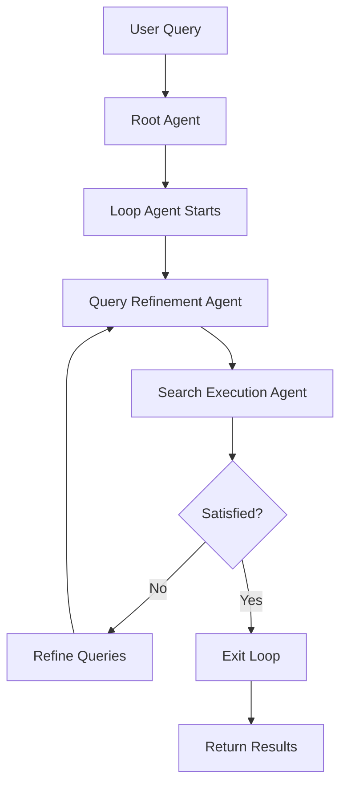

# Google ADK Visual Agent Builder Demo


*Multi-agent research system with iterative refinement pattern, built using Google ADK Visual Agent Builder's AI-first approach*

---

A complete demonstration of Google ADK's Visual Agent Builder, showcasing how to build complex multi-agent systems through natural language conversation with an AI Assistant. This research agent uses Google Search with a LoopAgent pattern for iterative query refinement.

**📝 Blog Post**: [Building AI Agents Visually with Google ADK Visual Agent Builder](https://medium.com/@chongcht/building-ai-agents-visually-with-google-adk-visual-agent-builder-bb441e59a78c)

---

## 🎯 What This Demo Shows

This repository demonstrates the **AI-first development workflow** using Google ADK Visual Agent Builder:

1. **Describe** your intent to the AI Assistant in natural language
2. **Generate** complete agent architectures automatically
3. **Review** the generated hierarchy on the visual canvas
4. **Test** immediately with real queries
5. **Deploy** production-ready YAML configurations

No manual YAML editing. No configuration errors. Just describe what you want, and the AI Assistant creates the architecture.

---

## 🏗️ Architecture

The research agent uses a hierarchical multi-agent pattern:

```
root_research_agent (ROOT)
└── research_loop_agent (LoopAgent, max_iterations=3)
    ├── query_refinement_agent (LlmAgent, gemini-2.5-pro)
    │   └── tool: google_search
    └── search_execution_agent (LlmAgent, gemini-2.5-flash)
        └── tool: google_search
```

**Key Features**:
- ✅ **Iterative Refinement**: Loop agent progressively improves search queries
- ✅ **Model Specialization**: gemini-2.5-pro for reasoning, gemini-2.5-flash for speed
- ✅ **Smart Termination**: `exit_loop` tool allows early exit when satisfied
- ✅ **Real Google Search**: Live integration with Google Search API

---

## 📦 What's Included

This demo contains the complete YAML configurations generated by the Visual Agent Builder:

```
agents/
├── root_agent.yaml                  # Root coordinator (LlmAgent, gemini-2.5-flash)
├── research_loop_agent.yaml         # Loop orchestrator (LoopAgent, max_iterations: 3)
├── query_refinement_agent.yaml      # Query enhancement (LlmAgent, gemini-2.5-pro)
└── search_execution_agent.yaml      # Search & synthesis (LlmAgent, gemini-2.5-flash)
```

All files are production-ready and can be deployed directly.

---

## 🚀 Quick Start

### Prerequisites

- Python 3.10 or higher
- Google Cloud Project with Gemini API access
- Google ADK v1.18.0+

### Installation

1. **Install Google ADK**:
```bash
pip install google-adk
```

2. **Set up Google Cloud credentials**:
```bash
export GOOGLE_CLOUD_PROJECT="your-project-id"
gcloud auth application-default login
```

3. **Clone this repository**:
```bash
git clone https://github.com/thomas-chong/google-adk-visual-agent-builder-demo.git
cd google-adk-visual-agent-builder-demo
```

---

## 💻 Usage

### Option 1: Run via ADK Web UI (Recommended)

Experience the Visual Agent Builder interface:

```bash
# Launch ADK web interface
adk web

# Open in browser
# http://localhost:8000/dev-ui/
```

**Steps**:
1. Click "+" to create new agent or import `agents/root_agent.yaml`
2. Explore the visual canvas showing the agent hierarchy
3. Test in the chat interface with research queries
4. View execution trace in the Events tab

### Option 2: Run via Python

```python
from google.adk.agents import LlmAgent

# Load the research agent
agent = LlmAgent.from_yaml_file("agents/root_agent.yaml")

# Run a research query
response = agent.run(
    "Research the latest developments in quantum computing error correction in 2024."
)
print(response)
```

---

## 🧪 Example Queries

Try these research topics:

**Quantum Computing**:
```
Research the latest developments in quantum computing error correction in 2024.
```

**AI/ML**:
```
Analyze recent breakthroughs in large language model training efficiency.
```

**Edge Computing**:
```
Investigate current trends in edge computing for IoT devices.
```

**Renewable Energy**:
```
Research advancements in solar panel efficiency over the past year.
```

### Expected Behavior

The agent will:
1. **Iteration 1**: Generate initial search queries, gather foundational information
2. **Iteration 2**: Identify gaps, refine queries, gather deeper details
3. **Iteration 3**: Synthesize comprehensive findings, determine if complete
4. **Output**: Well-structured research summary with key breakthroughs, comparisons, and future directions

**Typical execution time**: 60-90 seconds (3 iterations with Google Search calls)

---

## ⚙️ Configuration

### Change Max Iterations

Edit `agents/research_loop_agent.yaml`:
```yaml
max_iterations: 5  # Increase from 3 to 5
```

### Use Different Models

Edit any agent YAML:
```yaml
model: gemini-2.0-flash-exp  # Try newer models
```

### Customize Research Behavior

Modify the `instruction` field in agent YAML files:

**For more technical depth**:
```yaml
instruction: |
  Focus on technical details, implementation specifics, and academic research.
  Prioritize peer-reviewed papers and technical documentation.
```

**For business focus**:
```yaml
instruction: |
  Emphasize market trends, business implications, and ROI analysis.
  Include competitor analysis and market sizing.
```

### Add More Tools

Extend capabilities in agent YAML:
```yaml
tools:
  - name: google_search
  - name: url_context      # Fetch content from URLs
  - name: FilesRetrieval   # Analyze local files
```

---

## 📊 How It Works

### AI Assistant-First Development

This agent was created by describing requirements to the Visual Agent Builder's AI Assistant:

**Prompt**:
```
Create a research agent that uses Google Search with an iterative refinement
pattern. The agent should accept research topics, use a Loop agent pattern to
iteratively improve search queries, and have specialized sub-agents for query
refinement (gemini-2.5-pro) and search execution (gemini-2.5-flash).
```

**AI Assistant Response**:
- Proposed complete 4-agent architecture
- Selected appropriate models (pro for reasoning, flash for speed)
- Assigned tools (google_search, exit_loop)
- Generated detailed instructions for each agent
- Created all YAML files automatically

**No manual configuration needed!**

### Iterative Refinement Pattern



---

## 🎓 Learning Resources

### From This Demo

- **Blog Post**: [Building AI Agents Visually with Google ADK](YOUR_BLOG_URL)
- **Architecture Patterns**: Study the YAML files to understand multi-agent composition
- **AI Assistant Usage**: See how natural language generates complete architectures

### Official Documentation

- [Google ADK Python Repository](https://github.com/google/adk-python)
- [Visual Agent Builder Guide](https://github.com/google/adk-python/wiki/Development-Web-UI)
- [Agent Types and Hierarchy](https://github.com/google/adk-python/wiki/Agent-Types-and-Hierarchy)
- [Tool Framework](https://github.com/google/adk-python/wiki/Tool-Framework)

---

## 🛠️ Troubleshooting

### "No root_agent found" Error

**Cause**: Missing or incorrect file paths in YAML

**Solution**:
```bash
# Ensure all YAML files are in the same directory
ls -la *.yaml

# Files should show:
# root_agent.yaml
# research_loop_agent.yaml
# query_refinement_agent.yaml
# search_execution_agent.yaml
```

### API Authentication Errors

**Cause**: Google Cloud credentials not configured

**Solution**:
```bash
# Login with gcloud
gcloud auth application-default login

# Set project
gcloud config set project YOUR_PROJECT_ID

# Verify credentials
gcloud auth list
```

### Slow Execution

**Expected behavior**: Loop agents with external tools (Google Search) take 60-90 seconds for 3 iterations.

**To speed up**:
- Reduce `max_iterations` in `research_loop_agent.yaml`
- Use faster model: `gemini-2.0-flash-exp`
- Optimize search queries in agent instructions

### Empty or Poor Results

**Check**:
1. Google Search API is enabled in your GCP project
2. Search queries are specific enough (review query_refinement_agent output)
3. Loop hasn't exited too early (check iteration count in Events tab)

---

## 📈 Performance Notes

**Execution Metrics** (from demo):
- **Total time**: ~75 seconds
- **Loop iterations**: 3 (max)
- **Google Search calls**: 6-8 searches across iterations
- **Output quality**: Comprehensive 3,000+ word research summaries

**Cost Considerations**:
- Gemini API calls: ~$0.01-0.03 per research query
- Google Search API: Depends on your GCP quota
- Loop iterations significantly impact cost (fewer iterations = lower cost)

---

## 🔧 Advanced Customization

### Add Memory/Context

Enable conversation memory:

```yaml
# In root_agent.yaml
tools:
  - name: google_search
  - name: load_memory
  - name: preload_memory
```

### Create Domain-Specific Variants

**Medical Research Agent**:
- Change search queries to focus on PubMed, medical journals
- Add medical terminology to instructions
- Increase max_iterations for thorough analysis

**Market Research Agent**:
- Add financial data sources
- Focus on trends, market sizing, competitor analysis
- Include synthesis agent for SWOT analysis

**Code Research Agent**:
- Add GitHub search tools
- Focus on repositories, documentation, code examples
- Include code quality assessment criteria

---

## 🤝 Contributing

Found a bug or have a suggestion?

1. Open an [Issue](https://github.com/thomas-chong/google-adk-visual-agent-builder-demo/issues)
2. Submit a Pull Request with improvements
3. Share your customized agent configurations!

---

## 📄 License

MIT License - See [LICENSE](LICENSE) file for details.

Feel free to use this as a starting point for your own research agents!

---

## 👤 Author

**Thomas Chong**

AI Engineer passionate about building practical agent systems and exploring the future of AI-assisted development.

- 🔗 LinkedIn: [linkedin.com/in/chongcht](https://www.linkedin.com/in/chongcht/)
- 🐦 X/Twitter: [@cch_thomas](https://x.com/cch_thomas)
- 📝 Blog: [Medium](https://medium.com/@chongcht)

**Have questions or want to discuss agent architectures?** Reach out on LinkedIn or X!

---

## 🌟 Acknowledgments

- **Google ADK Team** for creating the Visual Agent Builder
- **Gemini Team** for the powerful AI models
- **Google Cloud** for the infrastructure and APIs

---

## 🏷️ Tags

`google-adk` `ai-agents` `multi-agent-systems` `gemini` `python` `agent-development` `visual-programming` `llm` `research-agent` `loop-agent` `iterative-refinement` `google-search`

---

**⭐ If you find this demo helpful, please star the repository!**

**📢 Share your agent architectures** - I'd love to see what you build with the Visual Agent Builder. Tag me on X/Twitter [@cch_thomas](https://x.com/cch_thomas)!

---

*Built with Google ADK v1.18.0 Visual Agent Builder*
*Last updated: 2025-11-10*
